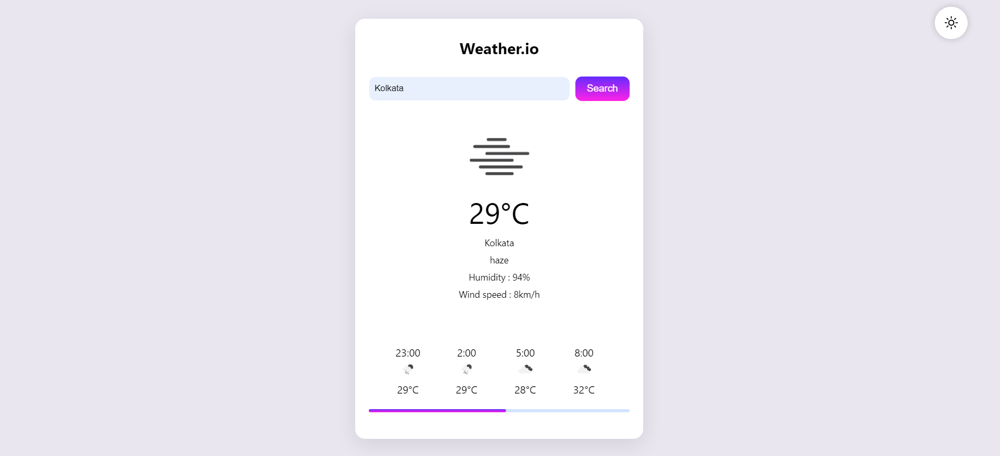

# Weather.io

## Project Description

**Weather.io** is a simple and intuitive weather application that allows users to get current weather conditions and hourly forecasts for any city in the world. The app provides real-time temperature, weather descriptions, humidity levels, wind speeds, and a 24-hour forecast in 3-hour intervals.

## Features

- **City Search:** Users can enter any city to fetch its current weather conditions.
- **Real-Time Data:** Displays current temperature, weather description, humidity, and wind speed.
- **24-Hour Forecast:** Provides a forecast for the next 24 hours in 3-hour intervals, including temperature and weather conditions.
- **Responsive Design:** Optimized for desktop and mobile devices.

## Screenshots




## How to Run

### Prerequisites

- A modern web browser (Chrome, Firefox, Safari, etc.)
- An internet connection to fetch data from the OpenWeather API.

### Steps to Run Locally

1. **Clone the Repository:**

   ```bash
   git clone https://github.com/your-username/weather-io.git
   cd weather-io
   ```

2. **Open the Project:**

   - Simply open the `index.html` file in your web browser.

   ```bash
   open index.html
   ```

3. **Enter a City:**

   - Type the name of the city you want to get the weather information for and press "Search."

## Deployment

The project is deployed and can be accessed [https://aurus18.github.io/Weather-App/].

## Technologies Used

- **HTML5**
- **CSS3**
- **JavaScript**
- **OpenWeather API**

## API Key

This project uses the OpenWeather API to fetch weather data. The API key is embedded in the `script.js` file.

```javascript
const apiKey = 'insert your own';
```
